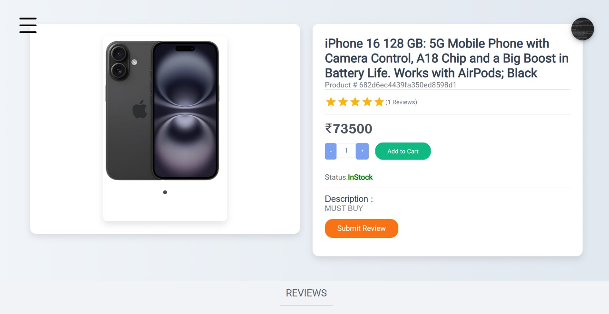

# 🛒 Novakart – Full Stack E-commerce Website

Novakart is a fully-featured e-commerce platform built using the **MERN stack** with secure authentication, Stripe-based payment integration, and admin/user role-based access.

---

## 🌐 Live Demo

🔗 [Demo Link](https://frontend-2-2vjy.vercel.app/)  


---

## ⚙️ Tech Stack

- **Frontend**: React.js, Redux, HTML/CSS
- **Backend**: Node.js, Express.js
- **Database**: MongoDB (Mongoose)
- **Authentication**: JWT
- **Payments**: Stripe
- **Email**: Nodemailer
- **Deployment**: Render, Vercel

---

## 📸 Screenshots

| Home Page | Product Page |
|-----------|--------------|
|  |  |


---

## 🔑 Features

- 🔐 Secure user authentication with JWT
- 🛍️ Product listing, filtering, and cart management
- 💳 Stripe integration for payments
- 📩 Email notifications using Nodemailer
- 👤 Admin panel for managing products & users
- 📱 Fully responsive for mobile and desktop

---

## 🚀 Installation

```bash

# Install dependencies
npm install && cd Frontend && npm install

# Start servers(Backend)
cd .. && npm run dev

📬 Contact
Created by Vinit Tandel
📧 tandelvinit714@gmail.com
